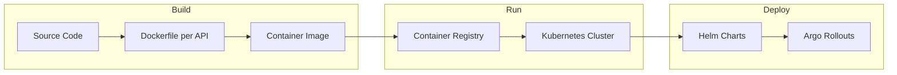
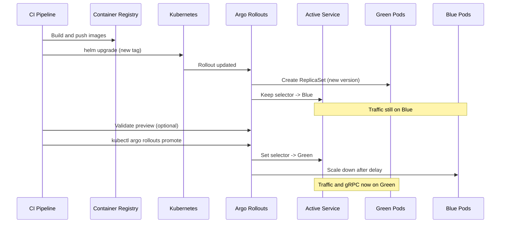

# Sol9 Blue-Green Deployment Plan

## 1. Solution and gRPC Context

Sol9 is a modular monolith with three deployable APIs:

- **Gateway.API** – YARP reverse proxy; routes HTTP to backends.
- **Bookings.API** and **Orders.API** – Each exposes HTTP (REST) and **gRPC** (Transponder transport). They talk to each other via gRPC for messaging (e.g. Orders → Bookings for `CreateBookingRequest`).

gRPC addresses are resolved at startup from configuration:

- **TransponderDefaults__LocalAddress** / **TransponderDefaults__RemoteAddress** (or `TransponderSettings`). In Kubernetes these are set to **K8s Service DNS names** (e.g. `http://bookings-api:80`, `http://orders-api:80`) so in-cluster gRPC uses the same Service as HTTP. See [Bookings.API/Program.cs](Sol9/Bookings.API/Program.cs) (e.g. lines 199–206, 269) and Helm [configmap](Sol9/K8s/helm/bookings-api/templates/configmap.yaml) / [values](Sol9/K8s/helm/bookings-api/values.yaml) (`env.transponderDefaults`).

So: **Docker** packages each API as an image; **Kubernetes** runs those images and provides Services; **blue-green** switches which ReplicaSet the Service points to without changing DNS. gRPC clients keep using the same service name; only the pods behind it change after promotion.

---

## 2. Where Docker and Kubernetes Fit



- **Docker**: Builds and runs each API (Gateway, Bookings, Orders) as a container. Ensures consistent runtime and makes the same artifact deployable locally (e.g. compose) and in K8s.
- **Kubernetes**: Schedules pods, exposes Services (ClusterIP) for HTTP and optional gRPC ports, provides DNS so `bookings-api` / `orders-api` resolve to the right pods. Ingress (optional) fronts the gateway.
- **Blue-green**: Implemented with **Argo Rollouts** in your existing Helm charts. When `rollout.enabled: true` and `rollout.strategy: blueGreen`, each API is deployed as a `Rollout` with an active Service and a preview Service; promotion switches traffic from blue to green.

---

## 3. Deployment Strategy (Step by Step)

### Phase A: Build and push images (Docker)

1. **Ensure Dockerfiles exist**  

[docs/Deployment/README.md](Sol9/docs/Deployment/README.md) references `Bookings.API/Dockerfile`, `Orders.API/Dockerfile`, `Gateway.API/Dockerfile`. If they are not in the repo, add multi-stage Dockerfiles that:

   - Restore and publish the corresponding `.csproj` (Release).
   - Use a runtime image (e.g. `mcr.microsoft.com/dotnet/aspnet`) and copy publish output.
   - Expose the app port (e.g. 8080) and set `ENTRYPOINT`/`CMD` to run the API.

2. **Build and tag** (e.g. with version or commit SHA):
   ```bash
   docker build -t <registry>/sol9/bookings-api:<tag> -f Bookings.API/Dockerfile .
   docker build -t <registry>/sol9/orders-api:<tag> -f Orders.API/Dockerfile .
   docker build -t <registry>/sol9/gateway-api:<tag> -f Gateway.API/Dockerfile .
   ```

3. **Push** to your container registry (GHCR, ACR, ECR, etc.):
   ```bash
   docker push <registry>/sol9/bookings-api:<tag>
   docker push <registry>/sol9/orders-api:<tag>
   docker push <registry>/sol9/gateway-api:<tag>
   ```


### Phase B: Deploy to Kubernetes (Helm)

4. **Prerequisites**

   - Cluster with **Argo Rollouts** controller installed.
   - Namespace (e.g. `sol9`), secrets (DB, Redis, image pull), and any shared infra (PostgreSQL, Redis) deployed—either via your Helm subcharts (postgres/redis in [bookings-api](Sol9/K8s/helm/bookings-api/values.yaml), [orders-api](Sol9/K8s/helm/orders-api/values.yaml)) or separately.

5. **Deployment order (to avoid gRPC/HTTP calls to not-yet-ready backends)**

   - **First**: Backend APIs (Bookings, Orders). They can be deployed in parallel; they only need DB/Redis and each other’s Service DNS (which will exist once Services are created).
   - **Second**: Gateway.API (depends on Bookings and Orders Services being up).

Example (separate releases; adjust release name and namespace):

   ```bash
   helm upgrade --install sol9-bookings ./K8s/helm/bookings-api -n sol9 -f values.prod.yaml --set image.tag=<tag>
   helm upgrade --install sol9-orders   ./K8s/helm/orders-api   -n sol9 -f values.prod.yaml --set image.tag=<tag>
   helm upgrade --install sol9-gateway ./K8s/helm/gateway-api  -n sol9 -f values.prod.yaml --set image.tag=<tag>
   ```

6. **Enable blue-green** in values (e.g. `values.prod.yaml` or per-chart overrides):

   - Set `rollout.enabled: true` and `rollout.strategy: blueGreen` for bookings-api, orders-api, and gateway-api (each chart already supports this: [bookings-api rollout](Sol9/K8s/helm/bookings-api/templates/rollout.yaml), [gateway-api rollout](Sol9/K8s/helm/gateway-api/templates/rollout.yaml)).
   - Tune `rollout.blueGreen` (e.g. `autoPromotionEnabled: false` for manual promote, `previewReplicaCount`, `scaleDownDelaySeconds`). Optional: enable `rollout.analysis` and set Prometheus address for automated analysis before promotion.

7. **gRPC in-cluster**  

   - Ensure ConfigMaps set `TransponderDefaults__LocalAddress` and `TransponderDefaults__RemoteAddress` to the K8s Service URLs (e.g. `http://sol9-bookings-bookings-api:80`, `http://sol9-orders-orders-api:80`—names depend on `fullname` from Helm). If you use a dedicated gRPC port, set `service.grpcPort` / `service.grpcTargetPort` in values and expose the gRPC port on the Service (and optionally on the [preview-service](Sol9/K8s/helm/bookings-api/templates/preview-service.yaml) if you want to hit green’s gRPC for tests).  
   - No change to blue-green logic: the **active** Service (e.g. `bookings-api`) keeps the same name; Argo only updates its selector to the green ReplicaSet on promotion, so gRPC clients continue to use the same DNS.

### Phase C: Blue-green flow per release

8. **Deploy new version (green)**  

`helm upgrade ... --set image.tag=<new-tag>` (or equivalent). Argo Rollouts:

   - Creates a new ReplicaSet (green) with the new image.
   - Keeps the active Service pointing at the current (blue) ReplicaSet.
   - Exposes green via the **preview** Service (e.g. `bookings-api-preview`) for validation.

9. **Validate green**  

   - Option A: Manual – call preview Service (and optionally gRPC if exposed on preview) or run smoke tests.
   - Option B: Automated – use Argo’s analysis with your existing [AnalysisTemplate](Sol9/K8s/helm/bookings-api/templates/analysis-template.yaml) (Prometheus success rate) if analysis is enabled.

10. **Promote**  

When satisfied:

    ```bash
    kubectl argo rollouts promote <rollout-name> -n sol9
    ```

Argo updates the **active** Service selector to the green ReplicaSet and scales down blue after `scaleDownDelaySeconds`. From then on, all HTTP and gRPC traffic to that Service goes to the new version.

11. **Rollback (if needed)**  

`kubectl argo rollouts abort <rollout-name> -n sol9` or revert to previous revision and re-run upgrade; Argo can also roll back to the previous ReplicaSet.

---

## 4. Gaps and Recommendations

| Item | Recommendation |

|------|----------------|

| **Dockerfiles** | Add under `Bookings.API/`, `Orders.API/`, `Gateway.API/` if missing; align with docs and CI. |

| **CI/CD** | Extend [.github/workflows/ci-cd.yml](Sol9/.github/workflows/ci-cd.yml): after publish, build Docker images, push to registry, then run `helm upgrade` (and optionally `kubectl argo rollouts promote` or a separate promote step). |

| **Preview Service gRPC** | [preview-service.yaml](Sol9/K8s/helm/bookings-api/templates/preview-service.yaml) only exposes HTTP. If you want to test gRPC against green, add a grpc port block mirroring the main [service](Sol9/K8s/helm/bookings-api/templates/service.yaml) when `service.grpcPort` is set. |

| **Deployment doc** | Update [docs/Deployment/README.md](Sol9/docs/Deployment/README.md) with: blue-green enable steps, Argo Rollouts prerequisite, promote/rollback commands, and gRPC service-name configuration. |

---

## 5. Summary Diagram



This plan fits Docker (build/push), Kubernetes (run and Services), and your existing Argo Rollouts blue-green setup, with gRPC continuing to use the same Service DNS before and after promotion.